# Must Love Dogs 

View the live project [here](https://samharms.github.io/Must-Love-Dogs/)

This website was created to demonstrate my front-end skills including HTML, CSS and JavaScript, for Milestone Project 2 of Code Institute’s Full Stack Developer course. The purpose of the project was to create a static website.

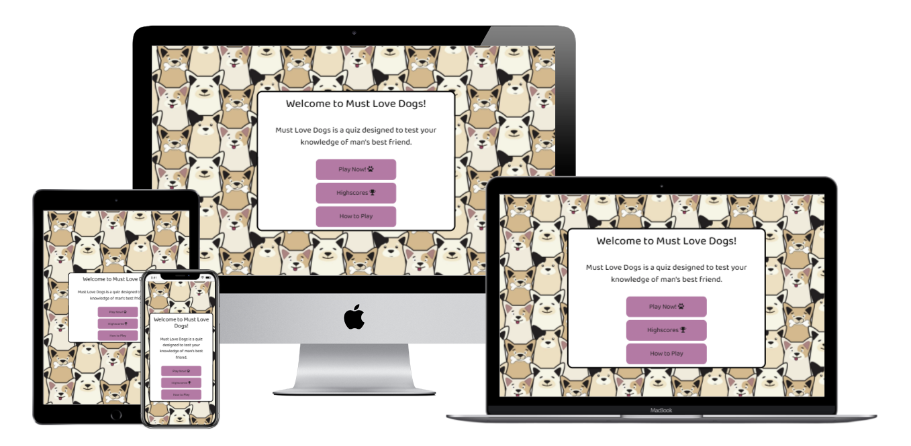

## User Experience (UX)

- ### User Stories

   - #### As a Site User

   1.	I want to easily understand the purpose of the website.

   2.	I want to be able to navigate the site easily with the minimum number of clicks to get to the desired information.

   3.	I want to easily access the rules of the game.

   4.	I want to be able to play a game that is fun and easy to understand.

   5.	I want to be able to save my score.

   6.	I want to be able to see high scores of other players.

   7.	I want to be able to sign up to be notified of new quizzes or questions.

- ### Design

   - #### Colour Scheme
    
     - The main colours used are white, black and purple to tie in with the background image and to give the site a fun, vibrant cartoon look.

   - #### Typography

     - The Baloo 2 font is the font used throughout the website with Sans Serif as the fallback font in case for any reason the font is not being imported into the site correctly. I used this font as it was fun and playful, which suited the vibe I was looking for.

   - #### Imagery

     - The background image was chosen as it is striking and fun which ties in with the mood of the website.   

- ### Wireframes and Mockups

- Landing Page Wireframe [Here](https://github.com/SamHarms/Must-love-dogs/blob/master/assets/images/readme-images/landing-page.png) 

- Question Page Wireframe [Here](https://github.com/SamHarms/Must-love-dogs/blob/master/assets/images/readme-images/quiz-page.png)

- End Page Wireframe [Here](https://github.com/SamHarms/Must-love-dogs/blob/master/assets/images/readme-images/end-page.png)

- Landing Page Mock-up [Here](https://github.com/SamHarms/Must-love-dogs/blob/master/assets/images/readme-images/landing-mockup.png)

- Question Page Mock-up [Here](https://github.com/SamHarms/Must-love-dogs/blob/master/assets/images/readme-images/question-mockup.png)

## Features

### Existing Features

- Responsive on all devices.

- Descriptive buttons used to provide ease of use and to minimise clicks.

- The home page includes a “how to play” modal which gives the user instructions on how the site works.

- The question page includes question and score counters which show the number of questions answered and the score so far.

- At the end of the quiz users have the option to save your score.

- Highscores page displays the top six scores.

- Newsletter form which provides a form for users to sign up to a newsletter to be notified of new quizzes.

- Each page includes a “go back home” button which will return the user to the landing page.

-	404 Page – A custom 404 page was created to deal with navigation errors and to direct users back to the homepage.

### Features Left to Implement

Quiz sites have endless possibilities of new features that could be added. Some of the main ones that I would like to add are as follows:

- Add images and videos to the quiz questions to make them more interesting and engaging.

- Different messages are currently displayed based on the users score. I would like to add images to match these messages.

-	Different topics to choose from. For example “breeds”, “famous dogs” etc.

## Technologies Used

- [HTML5](https://en.wikipedia.org/wiki/HTML5)
- [CSS3](https://en.wikipedia.org/wiki/CSS)
- [JavaScript](https://en.wikipedia.org/wiki/JavaScript)

## Frameworks, Libraries & Programs Used

- [Bootsrap 4.5](https://getbootstrap.com/docs/4.5/getting-started/introduction/)
  - Bootstrap was used to assist with the form and modal elements

- [Google Fonts](https://fonts.google.com/)
  - The Baloo 2 font used throughtout the website was imported from Google Fonts.

- [Font Awesome](https://fontawesome.com/)
  - Font Awesome icons were used on some of the buttons throughout the site.

- [jQuery](https://jquery.com/)
  - jQuery was installed with Bootstrap and was used to add functionality.

- [Git](https://git-scm.com/)
  - Git was used for version control by utilizing the Gitpod terminal to commit to Git and push to GitHub.

- [Github](https://github.com/)
  - GitHub is used to store the projects code after being pushed from Git.

- [Balsamiq](https://balsamiq.com/)
  - Balsamiq was used to create the wireframe mockups.

- [Google Chrome Developer Tools](https://developers.google.com/web/tools/chrome-devtools)
  - Chromes inbuilt developer tools were used to inspect elements of the page. 
    The Lighthouse feature was used to identify any problems affecting the site’s performance, accessibility, and user experience. 

- [Techsini](http://techsini.com/multi-mockup/index.php)
  - Techsini was used to create the mock up image in this README.

- [Canva](https://www.canva.com/)
  - Canva's image editor was used to create the landing page and question mock-ups and to resize the background image.

- [VectorStock](https://www.vectorstock.com/) 
  - The background image was downloaded from VectorStock.

- [EmailJS]( https://www.emailjs.com/)  
  - EmailJS was used in the newsletter signup form to send an email to my Gmail account when someone adds their details.

- [FreeFavicon](https://www.freefavicon.com/)
  - The paw print favicon was downloaded from Free Favicon.

## Testing

### Development Testing

 - Throughout development of the website I used the Google Chrome Developer tools to inspect the site at different device sizes and in responsive mode.

 - I also used Codeply to test out code before adding it to the Gitpod terminal.

### Manual Testing

 - In order to test that the buttons were working correctly I tested the following criteria.

   - Does each button redirect to the correct page? Yes
   - On desktop does each button move on hover and add box shadow? Yes

- In order to test that the modal was working correctly I tested the following criteria.
    - Does the model open when “how to play” button is clicked? Yes

   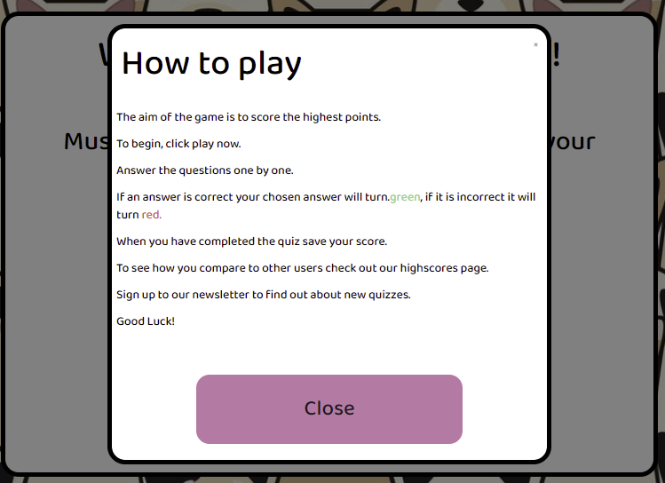

  - Does the modal close when the close button is clicked? Yes

 - In order to test that the correct colour is showing depending on whether the answer chosen was correct or incorrect I tested the following criteria.
    
   - Does the answer choice turn green or red depending on the answer chosen? Yes 

   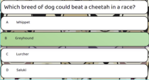

   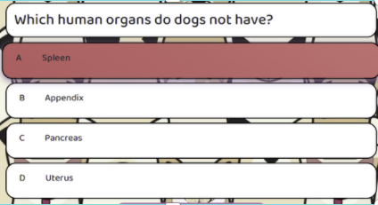

- In order to test that the question and score counters were working correctly I tested the following criteria.
 
  -	Does the number of questions answered increase after each question? Yes

   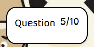

 -	Does the score increase after a correctly answered question? Yes

    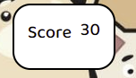

 - In order to test that the score submit form was working correctly I tested the following criteria.

   - Is the “save your score” button unavailable while input field is blank? Yes

    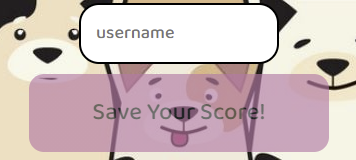

   - Is the score added to local storage? Yes

     - This was checked by the following:
       - Open google developer tools by right-clicking and choosing “inspect”
       - On the navigation bar choose “application”
       - Navigate to “local storage” and then select https://samharms.github.io
       - Check that the key and value for most recent score and highscores was saved

   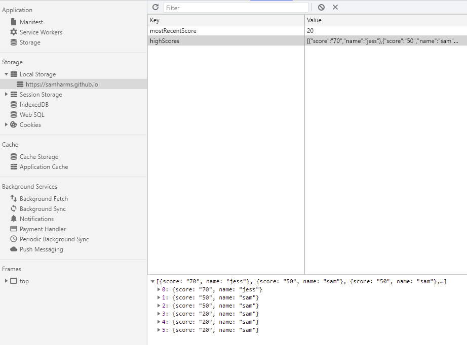

-  In order to test that the highscores saved to local storage were displaying I tested the following criteria.

   - When a user saves their score are they redirected to the highscores page? Yes

-	When on the highscores page are usernames and scores displayed as a list? Yes

    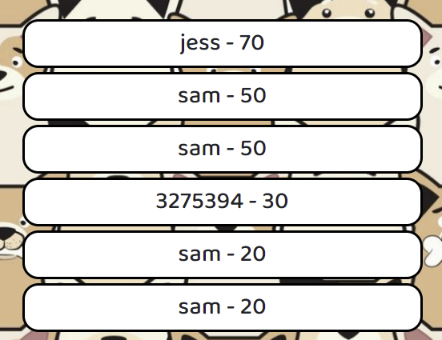

- In order to test that the newsletter sign up form was working correctly I tested the following criteria.

  - Does the completed form link to the correct place when submitted? Yes

   - Is the user prompted to complete all fields if input is missing? Yes

   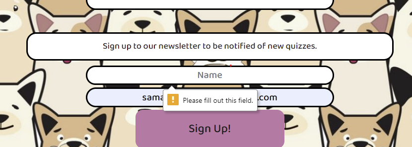

   -	Is the user notified when too few/too many characters are used? Yes

   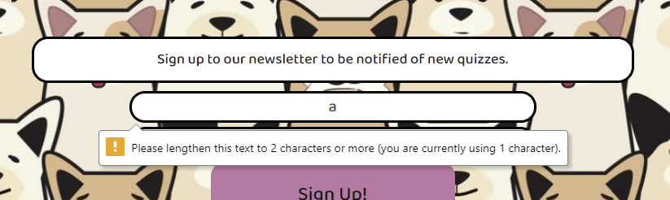

   - Is an email sent to the email account linked to EmailJS? Yes

   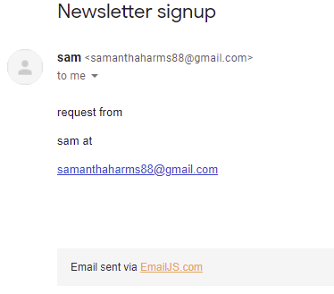

- In order to test that the correct message is displayed based on the users score I tested the following criteria.

  - After completing the quiz is a different message displayed based on score? Yes

   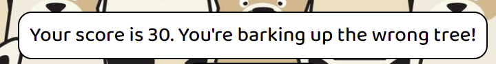

### Final testing

The W3C Markup Validator and W3C CSS Validator Services were used to validate the project to ensure there were no syntax errors in the project.

- [W3C Markup Validator](https://validator.w3.org/) - [Results](https://validator.w3.org/nu/?doc=https%3A%2F%2Fsamharms.github.io%2FMust-Love-Dogs%2F)
  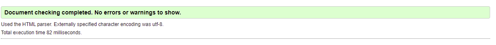

- [W3C CSS Validator](https://jigsaw.w3.org/css-validator/#validate_by_input) - Results below (please note that with direct input there were no errors in the CSS, but by url there were
errors relating to Bootstrap)

  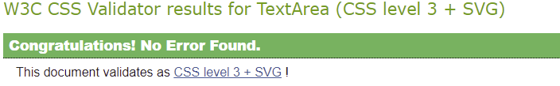

I have also thoroughly tested this website on the following devices and browsers to ensure that all links are working correctly. 
In addition, friends and family members were asked to review the site and documentation to point out any bugs and/or user experience issues.

- Devices used:

   - Samsung Galaxy S10 

   - Samsung Galaxy S9

   - Samsung Tab S6

   - Dell laptop – Latitude E5570, with large external monitor

- Browsers Used:
  - Chrome
  - Firefox
  - Microsoft Edge
  - Opera
  - Safari

I also used PowerMapper to double-check browser compatibility. As seen in the report below there were no issues with the latest version of each broswer apart from IE 11, however,
as IE is being replacted by Microsoft Edge this is not surprising. 

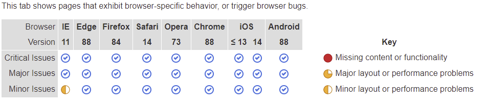

The Lighthouse function on Google Chrome Developer Tools was used to check the performance, accessibility, SEO and best practices. The report can be seen below.

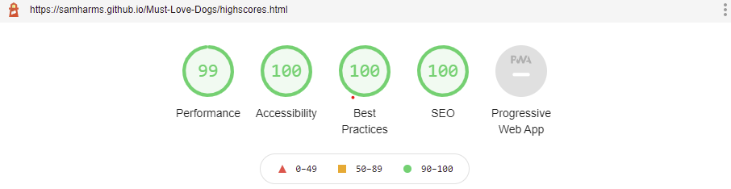

### Testing User Stories from User Experience (UX) Section

1.	As a user, I want to easily understand the purpose of the website.

       1. The homepage includes a short description of what the site is about.
     
 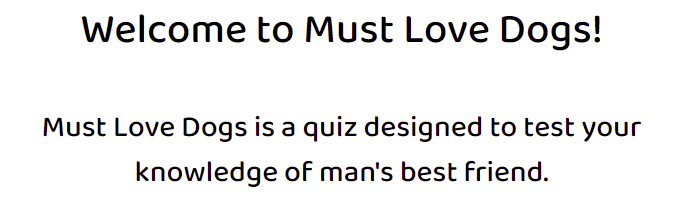

 2.  The rules modal also includes details of how the site works.

2.	I want to be able to navigate the site easily with the minimum number of clicks to get to the desired information.

     1.  The buttons on the home page are clearly identified and bring users to exactly where they want to go.

  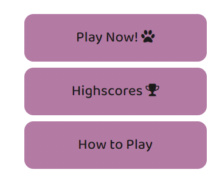

  2.  Each page, including the 404 page, includes a home button so that users can easily get back to the homepage where links to other areas of the site are included.

  3.  The end page has 

3.	I want to easily access the rules of the game.

  1.	The modal on the home page displays the rules to users.

    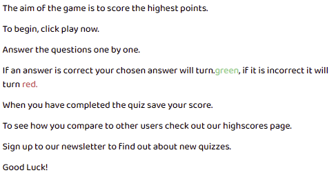

4.	I want to be able to play a game that is fun and easy to understand.

   1.  When choosing questions I looked up interesting facts about dogs including general facts about breeds and more interesting facts like dogs in movies and world records.

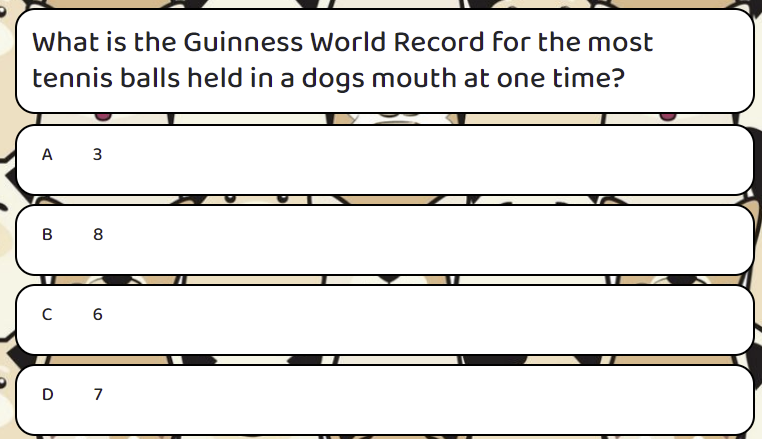

5.	I want to be able to save my score.
  
   1.  When a user completes the quiz they are taken to a page where they can add their user name and save their score.

   

6. I want to be able to see high scores of other players.

   1.  After a user saves their score they are taken directly to the highscores page.
   
    

   2.  Users can also access the list of highscores from the main page by clicking the “highscores” button

7.	I want to be able to sign up to be notified of new quizzes or questions.
       1.	On the highscores page there is a newsletter form which users can complete in order to subscribe and be notified of new quizzes.
      
      

      2. As a First Time Visitor, I want to be able to navigate the site easily with the minimum number of clicks to get to the desired information.

	  1. As the site is a single page all information is in one place.

      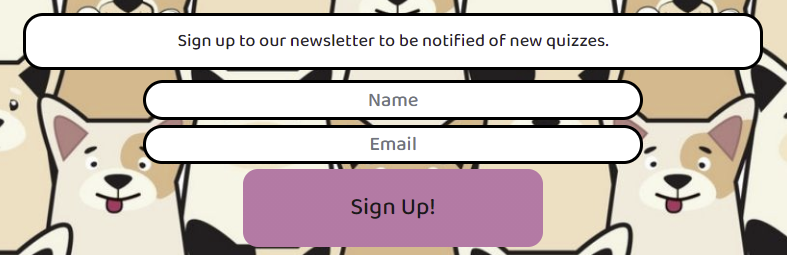

### Issues 

- When the site was pushed to GitHub the quiz and high scores pages were not showing. My mentor advised that this was simply because I had index.html linking to /game.html and /highscores.html rather than game.html and highscores.html.  

-	On touchscreen devices the hover effect that shows when a user chooses an answer was sticking on the next question. In order to fix this I added the “@media(hover: hover) and (pointer: fine” style as explained on [This]( https://medium.com/@mezoistvan/finally-a-css-only-solution-to-hover-on-touchscreens-c498af39c31c) site which solved the issue.
     
     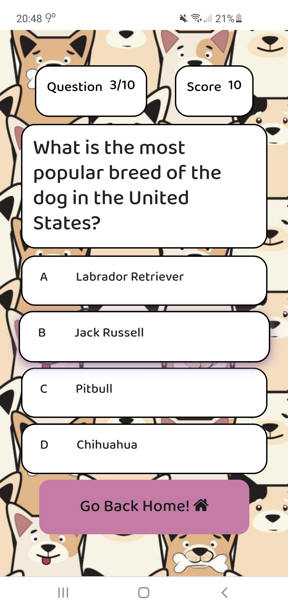

-	When I initially added the modal it was not displaying. [This]( https://stackoverflow.com/questions/17142790/bootstrap-modal-not-working-at-all/47235954) post from StackOverflow helped to solve the issue. 

### Known Bugs

- On some mobile screen the h1 on highscores.html is not visible

## Deployment 

### GitHub Pages

The project was deployed to GitHub Pages using the following steps

1.	Log in to GitHub and locate the [GitHub Repository](https://github.com/)
2.	At the top of the Repository (not top of page), locate the "Settings" Button on the menu.
3.	Scroll down the Settings page until you locate the "GitHub Pages" Section.
4.	Under "Source", click the dropdown called "None" and select "Master Branch".
5.	The page will automatically refresh.
6.	Scroll back down through the page to locate the now published site link in the "GitHub Pages" section.

### Forking the GitHub Repository

By forking the GitHub Repository we make a copy of the original repository on our GitHub account to view and/or make changes
 without affecting the original repository by using the following steps.

1.	Log in to GitHub and locate the GitHub Repository
2.	At the top of the Repository (not top of page) just above the "Settings" Button on the menu, locate the "Fork" Button.
3.	You should now have a copy of the original repository in your GitHub account.

### Making a Local Clone

1.	Log in to GitHub and locate the GitHub Repository
2.	Under the repository name, click "Clone or download".
3.	To clone the repository using HTTPS, under "Clone with HTTPS", copy the link.
4.	Open Git Bash
5.	Change the current working directory to the location where you want the cloned directory to be made.
6.	Type git clone, and then paste the URL you copied in Step 3.
7.	Press Enter. Your local clone will be created.

## Credits

### Code

- [Bootstrap 4.5](https://getbootstrap.com/docs/4.5/getting-started/introduction/): Bootstrap was used for the form and modal

 - [YouTube]( https://www.youtube.com/) I followed [this](https://www.youtube.com/watch?v=u98ROZjBWy8&list=PLDlWc9AfQBfZIkdVaOQXi1tizJeNJipEx) tutorial by James Q Quick to create the quiz template. It was incredibly helpful as everything was explained really well.

- (https://www.digitalocean.com/community/tutorials/how-to-add-a-favicon-to-your-website-with-html): I used this post on Digital Ocean to see where to insert the code for the favicon
- [Code Institute Full Stack Developer Course](https://codeinstitute.net/): Matt Rudges EmailJS tutorial was used to add the EmailJs newsletter sign up to the site.

### Content

All content was written by myself. I googled interesting facts about dogs and took some other dog quizzes for inspiration.

### Media

 - Background image downloaded from [VectorStock](https://www.vectorstock.com/)

### Acknowledgements

 - My mentor for his helpful feedback and tips.
 
 - Student care and fellow students at Code Institute for their support. Especially Miklos who spend numerous hours trying to fix an error in my JavaScript, unfortunately we ran out of time so reverted the code back to its previous state.

 

